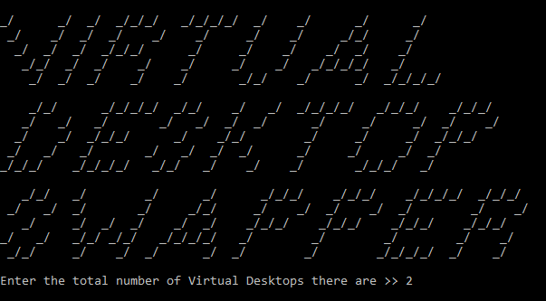
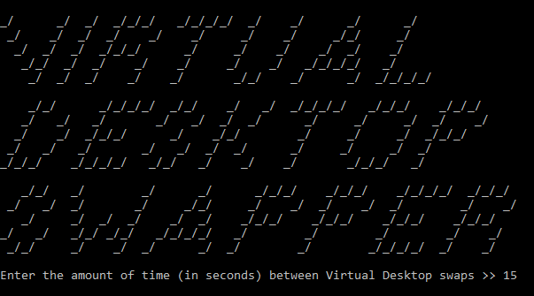
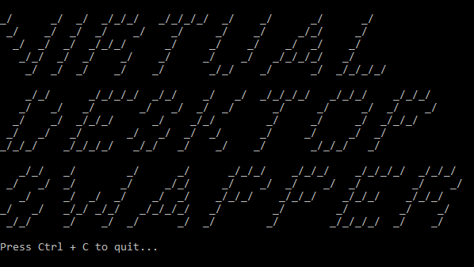

# Virtual Desktop Swapper

Tool for automatically swapping between Virtual Desktops on Windows 10. Project uses .NET Framework 4.7.2.

#### Running

* Windows GUI
  * Launch `VirtualDesktopSwapper.exe` from the `VirtualDesktopSwapper\bin\Debug\` directory.
* Windows CLI
  * `cd VirtualDesktopSwapper\bin\Debug\`
  * `.\VirtualDesktopSwapper.exe`

#### Input

Running Virtual Desktop Swapper will require user input. The first input will have you enter the total number of Virtual Desktops that you are currently using.

The second will ask you for the amount of time that you want to stay focused on a Virtual Desktop before swapping to the next.

#### Stopping

When the program is in focus use `ctrl + c` on your keyboard to quit Virtual Desktop Swapper.
